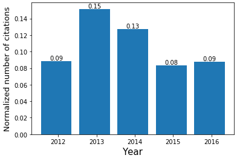
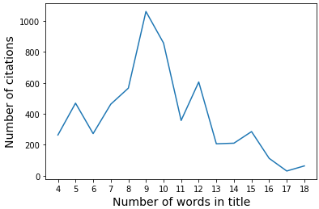

Bibliometric Analysis
=====================

The Bibliometrics class provides tools for a bibliometric analysis of Web of Science datasets. 

Members:

* titleClean: Clean title names (remove punctuation, stopwords and numbers).
* fundingClean: Clean funding agencies (remove grant number and punctuation) and group similar names.
* cit_by: Computes number of citations as function of the chosen parameter.
* cit_num: Computes number of citations per number of occurences in the chosen parameter.
* pub_by: Computes number of publications as function of the chosen parameter.
* pub_num: Computes number of publications per number of occurences in the chosen parameter. 
	
The definition of all these functions can be found at the bottom of that page.

All examples on this page are computed using a dataset of research publications citing at least one of the papers associated with the software ABINIT. Those co-citations are available on the Web of Science website and the data was converted to a Pandas dataframe with the methodology described in the :ref:`label-wos` page.

To start working with the pyBiblio package, you first have to import the package and create an object of the class Bibliometrics like so:

.. code-block:: python

        from pybiblio import bibliometrics
        analysis = bibliometrics.Bibliometrics()

Number of citations per year
^^^^^^^^^^^^^^^^^^^^^^^^^^^^

The number of citations per year can easily be obtained with the following line of code:

.. code-block:: python

	citYear = analysis.cit_by(data, by='PY', n=5, norm = True, sort = False)

"PY" is the WoS tag for the year of publication so the function will only consider this column to compute the number of citations. Null values in the chosen column will be deleted. By setting n=5, the above line of code returns a Pandas dataframe with 5 rows of highest frequency. Frequency values will be normalized over the total number of citations as the binary parameter norm is True and rows are sorted by year and not by frequency because the parameter sort is False.

Here is the result dataframe:

.. list-table:: Citations per year
    :widths: 10 10
    :header-rows: 1

    * - PY
      - freq
    * - 2012
      - 0.0883173
    * - 2013
      - 0.151677
    * - 2014
      - 0.127143
    * - 2015
      - 0.083359
    * - 2016
      - 0.0837868

The following lines of code help visualize the results in the previous table by graphing them in a bar plot: 

.. code-block:: python

	#import libraries
	import numpy as np
	import matplotlib.pyplot as plt
	
	r1 = np.arange(len(citYear))
	plt.bar(r1, citYear.freq) #barplot
	plt.xticks([r + 0.05 for r in range(len(citYear))], citYear.PY) #year labels
	plt.xlabel("Year", fontsize = 15)
	plt.ylabel("Normalized number of citations", fontsize = 13)
	#add the frequency values 
	for x,y in zip(r1, citYear.freq):
    		label = "{:.2f}".format(y)
    		plt.annotate(label, (x,y+0.0015), ha='center')

Number of publications by funding agency
^^^^^^^^^^^^^^^^^^^^^^^^^^^^^^^^^^^^^^^^

The WoS tag "FU" contains, for each paper, a string of all different funding agencies and their corresponding grant number separated by a semicolon. However, a lot of agencies are written in different manners. For example, "DOE", "Department of Energy", "US Department of Energy" and "US DOE" all represent the same agency. To minimize those difference, we created a file with common variations of over hundred of the most recurrent funding agencies in the field of Density Functional Theory. 

The text file 'FU.csv' consists of rows in the format: *derived name of the funding agency* \tab *official name*. 

Here is an example of the file format::

	US DOE	US DEPARTMENT OF ENERGY
	DOE	US DEPARTMENT OF ENERGY

We would appreciate any contributions to this file, as it will benefit any user to achieve more precise results. Please contact mcd0029@mix.wvu.edu if you would like to contribute.

The following line of code will compute the number of publications per funding agency:

.. code-block:: python

	pubFunding = analysis.pub_by(data, by='FU', dpc=['DI'], n=10, norm = False, sort = True)

The following table shows the results of the above line of code. The dpc parameter holds a list of column names considered for removing duplicates. In this example, papers with identical DOI numbers will be removed before any computation is performed. When several columns are mentioned, observations will be removed if they have only one match. The parameter norm is set to False, so the number of publications are not normalized and the sort parameter set to True means that the results will be sorted in descending order.

The results are listed below:

.. list-table:: Funding agencies with highest number of publications
	:widths: 30 10
	:header-rows: 1

	* - FU
	  - freq
	* - US NATIONAL SCIENCE FOUNDATION
	  - 287
	* - US DEPARTMENT OF ENERGY
	  - 211
	* - RESEARCH AND DEVELOPMENT PROGRAM OF CHINA
	  - 157
	* - RESEARCH FOUNDATION DFG
	  - 106
	* - EUROPEAN UNION 
	  - 75
	* - GENCI
	  - 68
	* - OFFICE OF NAVAL RESEARCH
	  - 62
	* - FONDS DE LA RECHERCHE SCIENTIFIQUE DE BELGIQUE
	  - 57
	* - RUSSIAN FOUNDATION FOR BASIC RESEARCH
	  - 54
	* - NATURAL SCIENCES AND ENGINEERING RESEARCH COUNCIL OF CANADA
	  - 47

Number of citations as function of the number of words in titles
^^^^^^^^^^^^^^^^^^^^^^^^^^^^^^^^^^^^^^^^^^^^^^^^^^^^^^^^^^^^^^^^

The functions *cit_num* and *pub_num* compute the number of different occurences (like number of different authors, countries or words) against the number of citations or publications (respectively). A good example is the following line of code:

.. code-block:: python

	citTitle = analysis.cit_num(data, by='TI', n=15, subset=['density', 'theory'], sep=',', norm = False, sort = False)

When the tag 'TI' is passed in the *by* parameter, the column holding titles is sent to the function *titleClean* that will remove any punctuation, symbols, hyperlinks, digits and stop words. The result will be a string of the remaining words joined by the separator chosen (in this case, a comma but the default is a semi-colon). To make it more clear, the title "The origin of incipient ferroelectricity in lead telluride" will return "ferroelectricity;incipient;lead;origin;telluride". Keeping the same example, the number of different occurences will be 5.

Another useful parameter available on all functions in the bibliometrics class is the subset parameter. This will help subset your data, before processing, according to the elements of the list. In the above line of code, we have two elements, meaning that a title will only be taken into account if both words "density" and "theory" are elements of the title. This parameter is case insensitive.

With some additional lines of codes, we can easily plot the results and determine the lengths of titles yielding the highest number of citations.

.. code-block:: python
	
	plt.plot(citTitle.numTI, citTitle.freq)
	plt.xlabel("Number of words in title", fontsize=14)
	plt.ylabel("Number of citations", fontsize=14)
	plt.xticks(citTitle.numTI)

Other Applications
^^^^^^^^^^^^^^^^^^

WoS tags are required by a function if you are working with the number of citations, the title or the funding agencies. However, the functions explained above can return a result for any chosen column that has a type float, int or string. 

Let's say that we manually add a column "topic" that will hold the general subject of a paper. This is not a Wos tag but the following line will return a pandas dataframe in the same manner as any other column:

.. code-block:: python

	pybiblio.pub_by(data, by='topic')
  

.. automodule:: pybiblio.bibliometrics
	:members:
